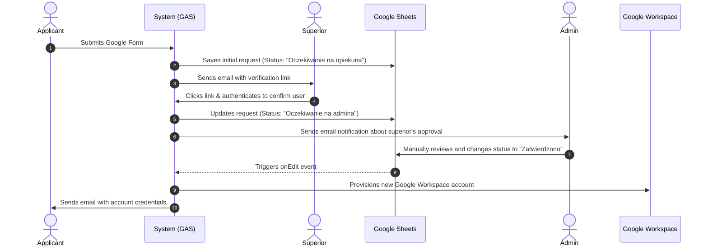
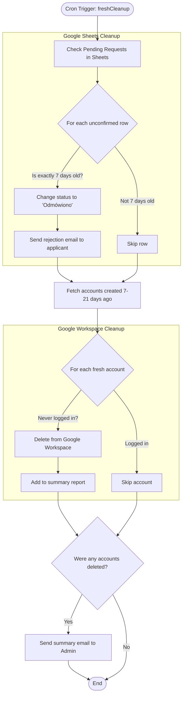
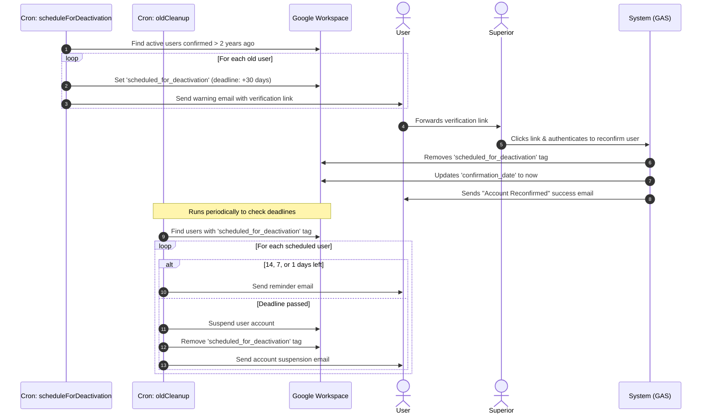

# user manager

Those scripts combine Google Forms, Sheets, Gmail and Admin panel together, to enable user creation
automatization. User registers using Forms, the data is passed to Sheets and mail is being
sent to the superior (passed in form field). After the supierior confirms the validity of request, the
admin is notified via email and can click to approve new user creation request.

## Build

The app is written with typescript modules for good ✨developer experience✨

But Google App Script doesn't handle modules, so we need to bundle the app:

```sh
npm run build
```

> ⚠️ `sed` is used for postprocessing build file, yeah, I'm a rollup noob

## Deploy

For deployment I've written script in `/utils`, which uses [clasp](https://github.com/google/clasp)

```
cd build
../utils/updateSheets.sh ../utils/sheets.json
```

What's in the `sheets.json`? You need to pass id to the compliant Google Sheet document.
Send mail request for template at: patryk.niedzwiedzinski at zhr.pl

## Automatic Deployment (GitHub Actions)

The project includes a GitHub Actions workflow to automate deployment upon pushing a new tag (e.g., `v1.0.0`).

### Prerequisities

You need to set up the following secrets in your GitHub repository settings:

1.  **`CLASPRS_JSON`**:

    - Login to Clasp locally: `npx clasp login`
    - This will create a `~/.clasprc.json` file.
    - Copy the content of this file and paste it as the secret value.

2.  **`ENV_FILE`**:

    - Content of your `.env` file (see `example.env`).

3.  **`SCRIPT_ID`**:
    - ID of script in script.google.com to deploy to (Sheets > Addons > Apps Script > id in url)
## Processes

### 1. User Creation

This sequence diagram illustrates the workflow of creating a new user account. It involves the applicant filling out a Google Form, the system notifying the requested superior, the superior verifying the request, and finally, the administrator approving it manually in Google Sheets.



### 2. Applications Cleanup (`freshCleanup`)

This flowchart details the `freshCleanup` process, which is responsible for keeping the system clean of abandoned requests and inactive accounts. It performs two main checks:
1. Rejects unconfirmed applications residing in Google Sheets that are exactly 7 days old.
2. Deletes freshly created Google Workspace accounts (7 to 21 days old) that have never been logged into.



### 3. Cyclic Account Deactivation (`scheduleForDeactivation` & `oldCleanup`)

This sequence diagram explains the periodic cleanup of inactive accounts. Users belonging to `NONLEADERS_GROUP` must revalidate their active status every 2 years.

**Important distinction:** Unlike new account creation where the superior is known, older accounts might have a new superior. Therefore, the user receives the verification link directly and must forward it to their current superior to confirm their status. The confirmation mechanism (`/confirm-zhr.html`) functions identically to new user creation.


